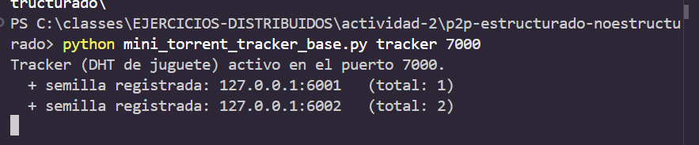
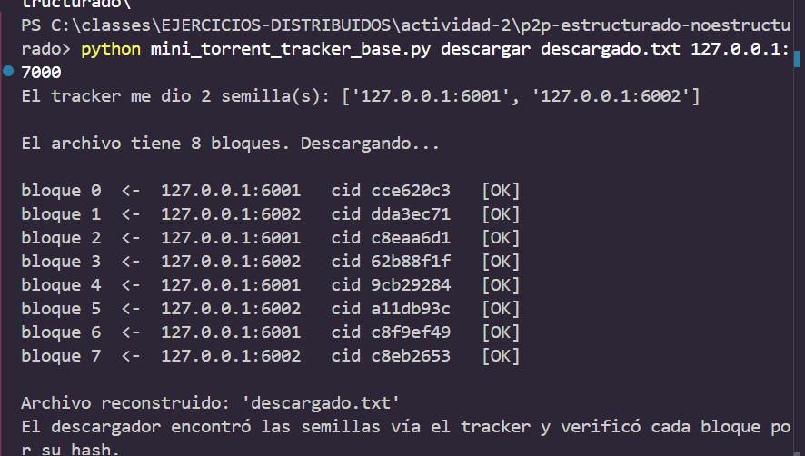

# Grupo 1 — P2P estructurado y no estructurado

## Material del grupo

- [Hoja de resumen](docs/Hoja_Resumen_P2P_Grupo1.pdf)
- [Presentación en PDF](docs/Diapositivas_Grupo1_P2P.pdf)

## Guía práctica

La actividad consiste en completar una simulación Mini-Torrent con
descubrimiento de peers mediante un tracker.

# Actividad: Mini-Torrent P2P con TRACKER (descubrimiento de peers)

**Asignatura:** Arquitecturas de Sistemas Distribuidos
**Nivel:** segunda parte del mini-torrent

## El problema que resolvemos aquí

> _"El reto técnico es localizar quién tiene cada recurso sin un índice central."_
> — resumen Grupo 1

Aquí añadimos un **TRACKER**: un directorio donde las semillas se **anuncian** y
al que el descargador **pregunta** quién tiene el archivo. Es una **DHT de juguete**:

- En **BitTorrent** ese papel lo hace el _tracker_ o la _Mainline DHT_ (Kademlia).
- En **IPFS** son los _provider records_ (`CID → peer`) sobre Kademlia.

(Nuestro tracker es un solo nodo central para que se entienda la idea; una DHT
real reparte ese directorio entre todos los nodos, sin punto central.)

## Cómo funciona

- `tracker`: guarda una lista de semillas. Entiende `ANNOUNCE` (registrarse) y `PEERS` (dar la lista).
- `seeder`: al arrancar se **anuncia** al tracker y luego sirve los bloques.
- `descargar`: le pide la lista al tracker y descarga de esas semillas (verificando hashes).

## Qué hacer

Completa los **4 TODO** en `mini_torrent_tracker_base.py`.

## Cómo probarlo (súper fácil)

**Terminal 1 (tracker):**

```
python mini_torrent_tracker_base.py tracker 7000
```

**Terminal 2 (semilla 1):**

```
python mini_torrent_tracker_base.py seeder 6001 cancion.txt 127.0.0.1:7000
```

**Terminal 3 (semilla 2):**

```
python mini_torrent_tracker_base.py seeder 6002 cancion.txt 127.0.0.1:7000
```

**Terminal 4 (descarga — fíjate que SOLO pasas el tracker):**

```
python mini_torrent_tracker_base.py descargar descargado.txt 127.0.0.1:7000
```

El descargador imprime las semillas que le dio el tracker y baja los bloques.

### Entre varias computadoras (misma red WiFi)

La compu del tracker averigua su IP (`ipconfig`, ej. `192.168.1.20`). Las semillas
y el descargador usan esa IP como tracker: `... 192.168.1.20:7000`.

## Qué entregar

- El código completado.
- Captura mostrando: el tracker registrando semillas y el descargador recibiendo la lista.
- Responde:
  1. ¿Qué pasa si el **tracker** se cae? ¿Por qué una **DHT real** (Chord/Kademlia) no tiene ese problema?
  2. ¿En qué se parece nuestro `ANNOUNCE`/`PEERS` a los _provider records_ de IPFS?
  3. ¿Por qué el descargador ya no necesita conocer las direcciones de antemano?

## Evaluación

| Criterio                                            | Puntos |
| --------------------------------------------------- | :----: |
| Completa los 4 TODO y todo funciona                 |   50   |
| El descargador descubre las semillas vía el tracker |   20   |
| Captura del tracker + descarga                      |   15   |
| Respuestas que conectan con DHT/IPFS de la teoría   |   15   |

## Reto extra (opcional)

El tracker es un **punto único de fallo** (si se cae, nadie encuentra nada). Investiga
cómo Kademlia reparte ese directorio entre todos los nodos para que no exista ese punto.

---

# Entrega 

## Código completado (los 4 TODO)

1. **Tracker registra la semilla** cuando recibe `ANNOUNCE`:
   `registro.add(f"{direccion[0]}:{puerto_semilla}")`
2. **Tracker responde la lista** cuando recibe `PEERS`:
   `conexion.sendall(" ".join(registro).encode())`
3. **La semilla se anuncia** al tracker al arrancar:
   `pedir(tracker, f"ANNOUNCE {puerto}")`
4. **El descargador pregunta** al tracker quién tiene el archivo:
   `respuesta = pedir(tracker, "PEERS").decode().strip()`

## Ejecución y capturas





## Respuestas a las preguntas

### 1. ¿Qué pasa si el tracker se cae? ¿Por qué una DHT real (Chord/Kademlia) no tiene ese problema?

Si el tracker se cae las semillas no tienen
dónde anunciarse y el descargador no obtiene la lista, aunque las semillas
sigan vivas con el archivo. 

Una DHT real no lo tiene porque el directorio se reparte entre todos los
nodos, cada nodo guarda una parte de las claves y cada registro se replica
en varios nodos cercanos. Si un nodo cae, sus datos siguen en las réplicas y
las búsquedas llegan por rutas alternativas


### 2. ¿En qué se parece nuestro ANNOUNCE/PEERS a los provider records de IPFS?

Es la misma idea: un mapeo de "recurso → quién lo tiene". Nuestro ANNOUNCE
equivale a publicar un provider record en IPFS, y nuestro
PEERS equivale a buscar el CID en la DHT para obtener los providers. La
diferencia es que en IPFS ese directorio no vive en un servidor central sino
repartido y replicado entre los nodos de Kademlia.

### 3. ¿Por qué el descargador ya no necesita conocer las direcciones de antemano?

Porque el descubrimiento ahora es dinámico: al descargador solo se le pasa
la dirección del tracker, y en tiempo de ejecución le pregunta con PEERS
quién tiene el archivo. Cualquier semilla nueva que se anuncie aparece
automáticamente en la lista, sin reconfigurar nada. Antes las direcciones eran
un dato fijo que había que pasar a mano; ahora se resuelven solas.
